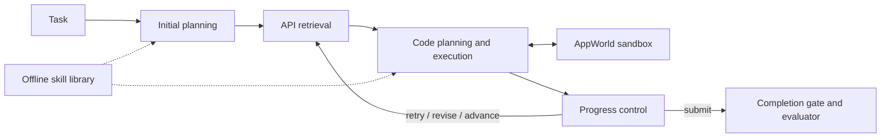

# SIMSA — Learning reusable skills for API task agents

A master's research project by **Yi Chien Lee**, National Taipei University of
Technology. Built with Python, Google ADK, Pydantic and AppWorld.

SIMSA executes multi-step API tasks and derives reusable instructions from
successful training trajectories. The research question is whether automatically
induced skills can reduce reliance on long, hand-written agent prompts.

## Results

| Experiment | Result |
|---|---|
| Full AppWorld `test_normal` | 96/168 tasks completed (57.1%) |
| Fixed 56-task comparison: no skills → curated skills | 24/56 → 32/56 |
| Full hand-written prompts vs. thin prompts + skills | 33/56 vs. 32/56 |
| Fixed instructions for three components | 4,184 → 297 words (−92.9%) |
| Candidate → curated skill library | 270 → 187 skills |

These are historical, single-seed thesis results. The prompt reduction concerns
**fixed instruction text**, not total tokens, cost or latency. A one-task
difference does not establish statistical equivalence. See [evaluation notes](docs/evaluation.md)
for the recent smoke comparison, methodology and limitations.

## How it works



The runtime owns state and enforces budgets; the progress-control agent proposes
the next action. Structured contracts, variable handoff and execution traces
make failures inspectable rather than relying on a final model response alone.

The offline workflow induces component-specific skills, reconstructs behavior
through deduction, evaluates candidates and refines induction prompts using
textual feedback. Library curation merges overlapping skills and sharpens their
retrieval descriptions. It does **not** update model weights.

## Start reviewing here

1. [An actual task run](docs/example-run.md) — follow the result without an API key
2. [Architecture and design choices](docs/architecture.md)
3. [`AppWorldAgent._run_one_cycle`](src/adk_appworld_agent/agent.py) — the runtime flow
4. [`progress_policy.py`](src/adk_appworld_agent/orchestration/progress_policy.py) — decision guards
5. [`mind_skill/loop.py`](src/mind_skill/loop.py) — induction, deduction and refinement
6. [`tests/`](tests/) — state ownership, contracts, recovery and evaluation tests

## Running the project

Try the core contract tests without credentials or AppWorld data:

```bash
uv sync --frozen --extra dev --extra runtime
uv run pytest -q tests/test_completion_gate.py tests/test_variable_store.py tests/test_scenario_goal_completion.py
```

See [setup and reproduction](docs/reproduction.md) for the full suite and live tasks. A local AppWorld installation
with data is required; live runs also require Gemini credentials and incur API
usage. Credentials, raw experiment logs and training trajectories are not bundled.

```bash
uv sync --frozen --extra dev --extra runtime
export APPWORLD_ROOT=/absolute/path/to/appworld
uv run pytest -q
```

For the five-task smoke, start the local RPC server as described in the setup
guide, then run:

```bash
uv run scripts/run_batch.py \
  --task_ids 13547f5_2,024c982_2,fd1f8fa_2,042a9fc_2,09b0ee6_2 \
  --config configs/portfolio_smoke.json \
  --experiment_name portfolio_smoke --rpc_url tcp://127.0.0.1:4244
```

## Repository scope

- `src/adk_appworld_agent/`: online runtime, workers, contracts and observability.
- `src/mind_skill/`: offline induction, deduction, judges and curation.
- `configs/`: explicit runtime settings and task splits.
- `data/api_graph/`: retrieval artifacts; `data/mind_skill/skills/release/thesis_final/`: curated text skills.
- `scripts/`: run, inspect and evaluate experiments; `tests/`: regression tests.

This is a clean source snapshot, not the original research repository or its
Git history. Personal notes, credentials, source trajectories, training-run
dumps and multi-gigabyte logs remain outside this portfolio.

## Scope and attribution

This is a benchmark research prototype, not a production automation service.
Multi-agent calls introduce latency and cost, model behavior can vary between
runs, and evaluation on one benchmark does not establish generalization to real
services. Production deployment would need additional authorization and safety controls.

The project uses Google ADK and AppWorld, adapts the MIND-Skill induction/deduction
method, and includes a CUGA-derived final-answer prompt. These are not claimed
as original work. See [third-party notices](THIRD_PARTY_NOTICES.md).
