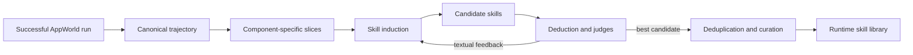

# Skill Induction Pipeline

This package contains SIMSA's offline skill-learning workflow. It converts
successful multi-agent AppWorld runs into reusable, component-specific
instructions and prepares those skills for runtime selection and injection.

The implementation adapts the induction/deduction idea from **MIND-Skill:
Quality-Guaranteed Skill Generation via Multi-Agent Induction and Deduction**
to a controller-managed agent with separate planner and executor components.

## Pipeline



1. **Trajectory assembly** combines controller events, subagent I/O and
   executor observations into a lossless research record.
2. **Slicing** creates separate examples for the rough planner, code planner
   and code executor.
3. **Induction** extracts reusable instructions from successful behavior.
4. **Deduction and refinement** reconstruct component behavior, judge outcome,
   reconstruction and skill quality, and improve the induction prompt through
   textual feedback. Planner deduction does not itself run a full sandbox task.
   The loop retains the best candidate without modifying model weights.
5. **Curation** consolidates overlap and sharpens skill names and descriptions.
6. **Runtime retrieval** selects top-k skills for a held-out task and injects
   them into intentionally thin prompts.

## Main Entry Points

| File | Purpose |
|---|---|
| `trajectory/build_trajectory.py` | Assemble a canonical trajectory from run artifacts |
| `induction/make_induction_slices.py` | Split a trajectory by agent component |
| `induction/build_induction_input.py` | Render model input for skill induction |
| `cli/run_induction_training.py` | Run induction over the training corpus |
| `loop.py`, `deduction/`, `judges/`, `textgrad/` | Reconstruct, judge and refine candidates |
| `cli/run_skill_train_eval.py` | Evaluate skills on configured task sets |
| `cli/finalize.py` | Publish training artifacts and per-iteration libraries |
| `curation/curate.py` / `curation/dedup.py` | Consolidate and deduplicate candidates |
| `runtime.py` | Load and retrieve skills for task execution |

Additional curation stages and reports live under
[`scripts/curation/`](../../scripts/curation/).
Run entry points from the repository root, for example
`uv run python -m mind_skill.cli.run_induction_training --help`.

## Canonical Trajectory

The trajectory schema preserves context, decision and observation together. It
records:

- the exact component input used for each decision;
- code-planning and sandbox execution observations;
- injected skills and their provenance;
- evaluator outcome and task metadata; and
- content-addressed system prompts to avoid duplicating static text.

See [`docs/trajectory_schema.md`](docs/trajectory_schema.md) for the schema and
[`docs/induction_inputs.md`](docs/induction_inputs.md) for the induction input
contract.

## Artifact Layout

```text
data/mind_skill/
├── source_trajectories/train/
├── training_runs/
└── skills/
    ├── induced/<component>/<run>/<library>/
    ├── refined/<component>/
    └── release/thesis_final/<component>/best/
```

The runtime's canonical skill root is
`data/mind_skill/skills/release/thesis_final`. The older data directories under
`data/mind_skill/_archive/` preserve experiment provenance but are not runtime
inputs.

## Reported Outcome

The study used 90 successful training trajectories, produced 270 candidate
skills and retained 187 after curation. On the fixed 56-task ablation, the
curated library improved task goal completion from 42.9% without skills to
57.1% with skills. Thin prompts plus skills completed 32/56 tasks, compared
with 33/56 for full hand-written prompts, while reducing fixed instruction text
from 4,184 to 297 words.

These are single-seed research results; small differences should not be treated
as statistically significant.
